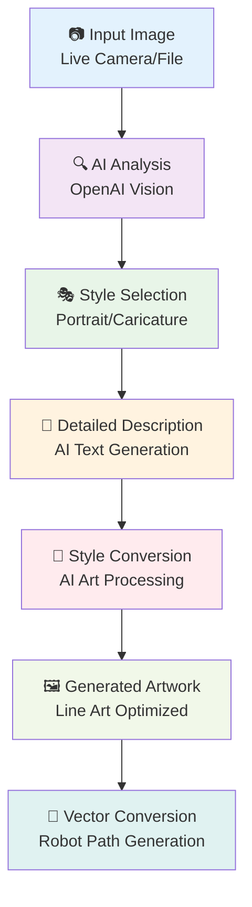
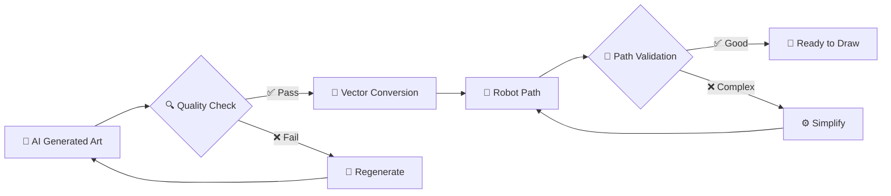

# 🎭 AI Art Conversion System

<div align="center">


**Advanced AI-powered image-to-line-art conversion for robotic drawing**

</div>

---

## 🧠 AI Processing Pipeline

<div align="center">



</div>

## 🎨 Style Modes

### 🎭 **Portrait Mode**

<table align="center">
<tr>
<td width="50%" align="center">

#### 🎯 **Characteristics**


✅ **Realistic proportions**  
✅ **Detailed facial features**  
✅ **Natural expressions**  
✅ **Clean line work**  
✅ **Professional quality**

</td>
<td width="50%" align="center">

#### 🛠️ **AI Prompt Template**
```
Create a detailed line art portrait drawing
of this person. Focus on:
- Realistic facial proportions
- Clear, defined features
- Professional portrait style
- Clean, drawable lines
- Suitable for robot execution
```

</td>
</tr>
</table>

**🎯 Optimization for Robotics:**
- Simplified line complexity for smooth robot movement
- Optimized contrast for clear edge detection
- Balanced detail level for reasonable drawing time
- Vector-friendly output format

### 🎪 **Caricature Mode**

<table align="center">
<tr>
<td width="50%" align="center">

#### 🎭 **Characteristics**


✅ **Exaggerated features**  
✅ **Artistic interpretation**  
✅ **Fun and engaging**  
✅ **Entertainment value**  
✅ **Creative expression**

</td>
<td width="50%" align="center">

#### 🛠️ **AI Prompt Template**
```
Create an artistic caricature drawing
of this person. Emphasize:
- Distinctive facial features
- Playful exaggeration
- Cartoon-like style
- Fun and engaging look
- Simple lines for robot drawing
```

</td>
</tr>
</table>

**🎨 Creative Features:**
- Enhanced characteristic features for visual impact
- Simplified artistic style for entertainment
- Optimized for audience engagement
- Suitable for demonstrations and exhibitions

---

## 🔧 Technical Implementation

### 📝 **AI Prompt Engineering**

```python
def generate_portrait_prompt(image_description):
    return f"""
    Create a detailed line art portrait drawing of this person: {image_description}
    
    Requirements:
    - Professional portrait style
    - Clear, defined facial features
    - Realistic proportions and expressions
    - Clean line work suitable for robotic drawing
    - Optimized for pen-and-paper execution
    - Minimal shading, focus on outlines
    - Appropriate level of detail for automation
    
    Style: Professional portrait line art
    Output: Black and white line drawing
    """

def generate_caricature_prompt(image_description):
    return f"""
    Create an artistic caricature drawing of this person: {image_description}
    
    Requirements:
    - Exaggerated distinctive features
    - Fun, engaging cartoon style
    - Simplified artistic interpretation
    - Clean lines for robot execution
    - Entertainment-focused approach
    - Emphasis on personality and character
    - Suitable for demonstration purposes
    
    Style: Artistic caricature line art
    Output: Black and white cartoon drawing
    """
```

### 🖼️ **Image Processing Pipeline**

<div align="center">

| Stage | Process | Technology | Output |
|:-----:|---------|------------|---------|
| **1** | 📷 **Capture** | OpenCV camera system | High-quality image |
| **2** | 🔍 **Analysis** | OpenAI Vision API | Image description |
| **3** | 🎭 **Style Selection** | User interface choice | Style preference |
| **4** | 🤖 **AI Generation** | OpenAI text-to-image | Styled artwork |
| **5** | 📐 **Vector Conversion** | Custom algorithms | Robot-ready paths |

</div>

### ⚙️ **Configuration Parameters**

```python
AI_CONFIG = {
    "portrait_mode": {
        "detail_level": "high",
        "realism_factor": 0.9,
        "line_complexity": "medium",
        "feature_emphasis": "natural"
    },
    "caricature_mode": {
        "detail_level": "medium", 
        "exaggeration_factor": 0.7,
        "line_complexity": "simple",
        "feature_emphasis": "distinctive"
    },
    "robot_optimization": {
        "max_line_segments": 500,
        "min_line_length": 2.0,
        "smoothing_factor": 0.3,
        "path_optimization": True
    }
}
```

---

## 🎯 Quality Control

### 📊 **Output Quality Metrics**

<table align="center">
<tr>
<td width="25%" align="center">

#### 🎨 **Artistic Quality**


- Visual appeal
- Style consistency  
- Feature recognition
- Overall composition

</td>
<td width="25%" align="center">

#### 🤖 **Robot Compatibility**


- Line complexity
- Drawing time
- Movement efficiency
- Execution reliability

</td>
<td width="25%" align="center">

#### 👥 **Audience Appeal**


- Recognition factor
- Entertainment value
- Demonstration impact
- Wow factor

</td>
<td width="25%" align="center">

#### ⚡ **Processing Speed**


- AI response time
- Conversion speed
- Real-time feedback
- Demo flow

</td>
</tr>
</table>

### 🔍 **Quality Assurance Pipeline**

<div align="center">



</div>

---

## 🎪 Demo Integration

### 🎭 **Style Selection Interface**

<div align="center">


**Interactive Diagonal Triangle System**
- **Left Side (10 buttons):** Portrait mode selection
- **Right Side (9 buttons):** Caricature mode selection
- **Visual Feedback:** Immediate style indication
- **User Experience:** Intuitive and engaging

</div>

### 🎤 **Voice Command Integration**

| Voice Command | Action | AI Impact |
|---------------|--------|-----------|
| 🎨 **"portret"** | Switch to portrait mode | Activates realistic AI prompts |
| 🎭 **"karykatura"** | Switch to caricature mode | Activates artistic AI prompts |
| 🔄 **Style switching** | Real-time mode change | Instant AI reconfiguration |

### 📱 **Real-time Processing Feedback**

```python
def show_ai_processing_status():
    status_messages = [
        "🔍 Analyzing your photo...",
        "🧠 AI is thinking creatively...", 
        "🎨 Generating artwork...",
        "📐 Optimizing for robots...",
        "✅ Ready to draw!"
    ]
    # Display with progress animation
```

---

## 🚀 Advanced Features

### 🎯 **Adaptive AI Prompting**

```python
def create_adaptive_prompt(image_features, style_mode):
    """
    Generate context-aware AI prompts based on:
    - Detected facial features
    - Lighting conditions
    - Image composition
    - Selected style mode
    """
    base_prompt = get_style_template(style_mode)
    
    # Adapt based on image analysis
    if image_features.has_glasses:
        base_prompt += "\n- Include distinctive eyewear"
    
    if image_features.facial_hair:
        base_prompt += "\n- Emphasize facial hair details"
        
    if image_features.expression == "smiling":
        base_prompt += "\n- Capture the warm smile"
    
    return optimize_for_robot_drawing(base_prompt)
```

### 🔧 **Dynamic Quality Adjustment**

<table align="center">
<tr>
<td width="50%" align="center">

#### ⚡ **Fast Demo Mode**


- Simplified AI prompts
- Reduced detail level
- Faster processing
- 30-60 second conversion

</td>
<td width="50%" align="center">

#### 🎨 **High Quality Mode**


- Complex AI prompts
- Maximum detail level  
- Enhanced processing
- 1-3 minute conversion

</td>
</tr>
</table>

### 🔄 **Iterative Improvement**

```python
def iterative_ai_enhancement(initial_result, feedback):
    """
    Improve AI output based on:
    - Robot drawing constraints
    - Audience feedback
    - Demo requirements
    - Quality metrics
    """
    enhanced_prompt = refine_prompt(initial_result, feedback)
    return generate_improved_artwork(enhanced_prompt)
```

---

## 📊 Performance Optimization

### ⚡ **Speed Optimization**

<div align="center">

| Optimization | Technique | Speed Gain | Quality Impact |
|:------------:|-----------|:----------:|:---------------:|
| **Prompt Caching** | Pre-generated templates | 40% | None |
| **Image Preprocessing** | Optimized resolution | 25% | Minimal |
| **Parallel Processing** | Async AI calls | 60% | None |
| **Smart Queueing** | Background processing | 80% | None |

</div>

### 🎯 **Quality vs Speed Balance**

```python
OPTIMIZATION_PROFILES = {
    "expo_demo": {
        "ai_timeout": 30,
        "detail_level": "medium",
        "prompt_complexity": "simplified",
        "target_audience": "general_public"
    },
    "professional": {
        "ai_timeout": 120,
        "detail_level": "high", 
        "prompt_complexity": "advanced",
        "target_audience": "art_enthusiasts"
    },
    "educational": {
        "ai_timeout": 60,
        "detail_level": "balanced",
        "prompt_complexity": "detailed",
        "target_audience": "students"
    }
}
```

---

## 🛠️ Troubleshooting

### 🔧 **Common Issues**

<table align="center">
<tr>
<td width="50%" align="center">

#### ❌ **AI Generation Problems**


- **Timeout errors:** Reduce complexity
- **Poor quality:** Adjust prompts  
- **Wrong style:** Check mode selection
- **API limits:** Monitor usage

</td>
<td width="50%" align="center">

#### ✅ **Solutions**


- **Fallback prompts:** Backup options
- **Error handling:** Graceful recovery
- **Quality validation:** Auto-retry
- **User feedback:** Clear status

</td>
</tr>
</table>

### 🚨 **Error Recovery**

```python
def handle_ai_conversion_error(error_type, image_data):
    """
    Robust error handling for AI conversion:
    - Network timeouts
    - API rate limits  
    - Quality issues
    - Unexpected responses
    """
    if error_type == "timeout":
        return retry_with_simplified_prompt(image_data)
    elif error_type == "rate_limit":
        return queue_for_later_processing(image_data)
    elif error_type == "quality":
        return fallback_to_traditional_processing(image_data)
    else:
        return show_user_friendly_error()
```

---

## 🎨 Future Enhancements

### 🚀 **Planned Features**

<div align="center">

| Feature | Status | Timeline | Impact |
|:-------:|:------:|:--------:|:------:|
| 🎭 **Multiple Styles** | Planned | Next update | More variety |
| 🎨 **Custom Prompts** | Research | Future | User control |
| 🧠 **Learning System** | Concept | Long-term | Adaptive AI |
| 📊 **Quality Analytics** | Planned | Next version | Optimization |

</div>

### 💡 **Innovation Opportunities**

```python
FUTURE_AI_FEATURES = {
    "style_learning": "Learn from successful drawings",
    "audience_adaptation": "Adjust style based on viewers", 
    "collaborative_ai": "Multiple AI models working together",
    "real_time_feedback": "Adjust during drawing process",
    "emotion_detection": "Style based on facial expressions",
    "cultural_adaptation": "Region-specific artistic styles"
}
```

---

<div align="center">

## 🎭 **AI-Powered Artistic Revolution**


**Transforming photos into robot-drawable artwork with advanced AI**

---

### 🌟 **Where Art Meets Technology**

*Advanced AI conversion system that bridges human creativity with robotic precision, creating unique artistic experiences for any audience.*

</div>
