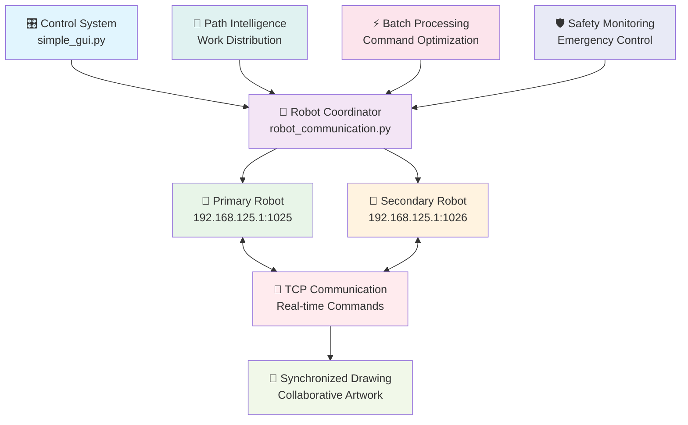
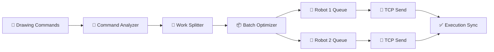
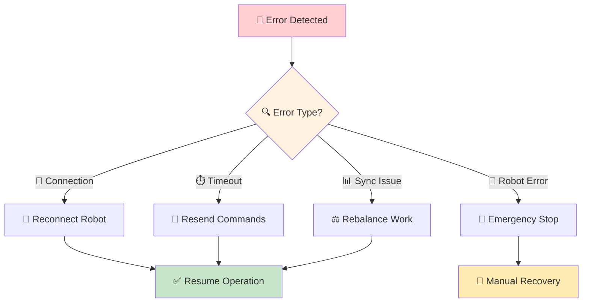

# 🤖 Dual-Robot Coordination System

<div align="center">


**Advanced dual-arm robot coordination with intelligent work distribution and real-time synchronization**

</div>

---

## 🎯 System Architecture

<div align="center">



</div>

## 🚀 Coordination Features

### 🧠 **Intelligent Work Distribution**

<table align="center">
<tr>
<td width="50%" align="center">

#### 🎯 **Path Analysis**


✅ **Contour complexity analysis**  
✅ **Optimal work splitting**  
✅ **Distance-based assignment**  
✅ **Load balancing**  
✅ **Execution time optimization**

</td>
<td width="50%" align="center">

#### ⚡ **Real-time Coordination**


✅ **Parallel command execution**  
✅ **Batch processing optimization**  
✅ **Automatic synchronization**  
✅ **Dynamic workload adjustment**  
✅ **Progress monitoring**

</td>
</tr>
</table>

### 🎨 **Drawing Coordination Modes**

<div align="center">

| Mode | Description | Best For | Performance |
|:----:|-------------|----------|:-----------:|
| 🔄 **Parallel** | Both robots work simultaneously | Large drawings | 🚀 Fastest |
| 🔀 **Alternating** | Robots take turns by region | Complex details | ⚖️ Balanced |
| 🎯 **Specialized** | Each robot handles specific features | Portrait work | 🎨 Highest quality |
| 🛡️ **Backup** | One robot, other on standby | Safety critical | 🛡️ Most reliable |

</div>

---

## 📡 Communication Protocol

### 🔧 **TCP Connection Management**

```python
class DualRobotCommunicator:
    def __init__(self):
        self.primary_robot = {
            "ip": "192.168.125.1",
            "port": 1025,
            "role": "primary",
            "status": "disconnected"
        }
        self.secondary_robot = {
            "ip": "192.168.125.1", 
            "port": 1026,
            "role": "secondary",
            "status": "disconnected"
        }
        
    def establish_dual_connection(self):
        """
        Establish connections to both robots with error handling
        """
        connections = []
        for robot in [self.primary_robot, self.secondary_robot]:
            try:
                conn = socket.socket(socket.AF_INET, socket.SOCK_STREAM)
                conn.settimeout(10)
                conn.connect((robot["ip"], robot["port"]))
                connections.append(conn)
                robot["status"] = "connected"
            except Exception as e:
                self.handle_connection_error(robot, e)
        
        return connections
```

### ⚡ **Command Synchronization**

<div align="center">



</div>

### 🎯 **Batch Processing System**

```python
def create_synchronized_batches(contours, batch_size=10):
    """
    Create optimized command batches for dual robot execution
    """
    primary_batch = []
    secondary_batch = []
    
    # Distribute contours based on complexity and position
    for i, contour in enumerate(contours):
        if should_assign_to_primary(contour, i):
            primary_batch.extend(contour_to_commands(contour))
        else:
            secondary_batch.extend(contour_to_commands(contour))
            
        # Create synchronized execution points
        if len(primary_batch) >= batch_size or len(secondary_batch) >= batch_size:
            yield (primary_batch[:batch_size], secondary_batch[:batch_size])
            primary_batch = primary_batch[batch_size:]
            secondary_batch = secondary_batch[batch_size:]
```

---

## 🎯 Work Distribution Algorithms

### 🧠 **Intelligent Assignment**

<table align="center">
<tr>
<td width="25%" align="center">

#### 📍 **Position-Based**


- Left/right workspace division
- Optimal robot positioning
- Minimal travel distance
- Workspace efficiency

</td>
<td width="25%" align="center">

#### 🎨 **Complexity-Based**


- Detailed vs simple regions
- Balanced workload
- Skill-based assignment
- Quality optimization

</td>
<td width="25%" align="center">

#### ⏱️ **Time-Based**


- Simultaneous completion
- Parallel execution
- Progress synchronization
- Efficient coordination

</td>
<td width="25%" align="center">

#### 🔄 **Dynamic**


- Real-time adjustment
- Progress monitoring
- Workload rebalancing
- Error recovery

</td>
</tr>
</table>

### 📊 **Algorithm Selection**

```python
def select_distribution_algorithm(drawing_data):
    """
    Choose optimal work distribution based on drawing characteristics
    """
    contour_count = len(drawing_data.contours)
    complexity_avg = calculate_average_complexity(drawing_data)
    workspace_distribution = analyze_spatial_distribution(drawing_data)
    
    if contour_count > 20 and complexity_avg < 0.5:
        return "position_based_parallel"
    elif complexity_avg > 0.8:
        return "complexity_balanced"
    elif workspace_distribution.is_concentrated:
        return "alternating_regions"
    else:
        return "dynamic_adaptive"
```

---

## ⚡ Performance Optimization

### 🚀 **Speed Enhancements**

<div align="center">

| Optimization | Technique | Speed Gain | Implementation |
|:------------:|-----------|:----------:|:---------------:|
| **Parallel Commands** | Simultaneous execution | 40-60% | Async TCP |
| **Batch Processing** | Command grouping | 25-35% | Smart batching |
| **Path Optimization** | TSP algorithms | 20-30% | Route planning |
| **Workspace Division** | Spatial partitioning | 15-25% | Area assignment |

</div>

### ⚖️ **Load Balancing**

```python
class WorkloadBalancer:
    def __init__(self):
        self.robot_capabilities = {
            "primary": {
                "max_speed": 100,
                "precision": 0.1,
                "workspace": "left_dominant"
            },
            "secondary": {
                "max_speed": 100,
                "precision": 0.1, 
                "workspace": "right_dominant"
            }
        }
        
    def balance_workload(self, contours):
        """
        Distribute work to achieve optimal completion times
        """
        primary_load = []
        secondary_load = []
        
        for contour in sorted(contours, key=self.complexity_score):
            if self.get_load_time(primary_load) <= self.get_load_time(secondary_load):
                primary_load.append(contour)
            else:
                secondary_load.append(contour)
                
        return primary_load, secondary_load
```

---

## 🛡️ Safety & Monitoring

### 🚨 **Safety Systems**

<table align="center">
<tr>
<td width="50%" align="center">

#### 🛑 **Emergency Stop**


- **Instant halt:** Both robots stop immediately
- **Safe positioning:** Return to safe positions
- **Connection recovery:** Maintain communication
- **Status reporting:** Clear system state

</td>
<td width="50%" align="center">

#### 🔍 **Health Monitoring**


- **Connection status:** Real-time monitoring
- **Command response:** Execution verification
- **Error detection:** Automatic problem identification
- **Performance metrics:** Efficiency tracking

</td>
</tr>
</table>

### 📊 **Real-time Monitoring**

```python
def monitor_dual_robot_execution(robot_connections):
    """
    Real-time monitoring of dual robot execution
    """
    while drawing_in_progress:
        # Check connection health
        primary_status = check_robot_health(robot_connections[0])
        secondary_status = check_robot_health(robot_connections[1])
        
        # Monitor progress synchronization
        sync_status = check_synchronization_status()
        
        # Update GUI progress indicators
        update_progress_display(primary_status, secondary_status, sync_status)
        
        # Handle any issues
        if not (primary_status.healthy and secondary_status.healthy):
            handle_robot_error()
            
        time.sleep(0.1)  # 10Hz monitoring rate
```

### 🔧 **Error Recovery**

<div align="center">



</div>

---

## 🎪 Exhibition Integration

### 🎭 **Demo Coordination**

<table align="center">
<tr>
<td width="33%" align="center">

#### 👥 **Audience Experience**


- Visual coordination display
- Progress synchronization
- Dual robot choreography
- Educational explanations

</td>
<td width="33%" align="center">

#### 🎯 **Performance Optimization**


- Optimized for viewing
- Minimal interruptions
- Smooth coordination
- Professional appearance

</td>
<td width="33%" align="center">

#### 🛡️ **Safety Integration**


- Audience safety zones
- Emergency procedures
- Clear workspace
- Controlled environment

</td>
</tr>
</table>

### 🎨 **Choreographed Movement**

```python
def create_demo_choreography(drawing_commands):
    """
    Create visually appealing robot movement patterns for demonstrations
    """
    choreography = {
        "opening": synchronize_startup_sequence(),
        "drawing": coordinate_artistic_movements(drawing_commands),
        "coordination": highlight_collaboration_moments(),
        "finishing": synchronize_completion_sequence()
    }
    
    return optimize_for_audience_engagement(choreography)
```

---

## 📈 Performance Metrics

### 📊 **Coordination Efficiency**

<div align="center">

| Metric | Single Robot | Dual Robot | Improvement |
|:------:|:------------:|:----------:|:-----------:|
| **Drawing Time** | 100% | 55-65% | 35-45% faster |
| **Path Efficiency** | 100% | 80-90% | 10-20% better |
| **Workspace Usage** | 50% | 85-95% | 35-45% better |
| **Demo Appeal** | Good | Excellent | High impact |

</div>

### 🎯 **Quality Metrics**

```python
def calculate_coordination_efficiency(execution_data):
    """
    Calculate various efficiency metrics for dual robot coordination
    """
    metrics = {
        "time_reduction": calculate_time_savings(execution_data),
        "synchronization_score": measure_sync_quality(execution_data),
        "workload_balance": analyze_work_distribution(execution_data),
        "error_rate": count_coordination_errors(execution_data),
        "audience_engagement": measure_demo_impact(execution_data)
    }
    
    return generate_performance_report(metrics)
```

---

## 🚀 Advanced Features

### 🧠 **Machine Learning Integration**

<table align="center">
<tr>
<td width="50%" align="center">

#### 📈 **Learning Optimization**


- Pattern recognition for optimal distribution
- Performance history analysis
- Adaptive algorithm selection
- Continuous improvement

</td>
<td width="50%" align="center">

#### 🎯 **Predictive Coordination**


- Drawing time prediction
- Resource requirement forecasting
- Optimal scheduling
- Proactive optimization

</td>
</tr>
</table>

### 🔄 **Dynamic Adaptation**

```python
class AdaptiveCoordinator:
    def __init__(self):
        self.performance_history = []
        self.adaptation_engine = MLCoordinationModel()
        
    def adapt_strategy(self, current_drawing, performance_feedback):
        """
        Dynamically adapt coordination strategy based on real-time feedback
        """
        # Analyze current performance
        current_metrics = self.analyze_current_performance()
        
        # Predict optimal strategy
        optimal_strategy = self.adaptation_engine.predict(
            drawing_complexity=current_drawing.complexity,
            workspace_distribution=current_drawing.spatial_features,
            historical_performance=self.performance_history
        )
        
        # Implement strategy adjustments
        return self.implement_strategy_changes(optimal_strategy)
```

---

## 🔧 Technical Specifications

### 🌐 **Network Configuration**

<div align="center">

| Parameter | Primary Robot | Secondary Robot | Notes |
|:---------:|:-------------:|:---------------:|:-----:|
| **IP Address** | 192.168.125.1 | 192.168.125.1 | Shared network |
| **Port** | 1025 | 1026 | Unique ports |
| **Protocol** | TCP/IP | TCP/IP | Reliable communication |
| **Timeout** | 10 seconds | 10 seconds | Connection reliability |
| **Buffer Size** | 1024 bytes | 1024 bytes | Command capacity |

</div>

### 📝 **Command Protocol**

```python
DUAL_ROBOT_COMMANDS = {
    "movement": {
        "MOVE": "MOVE,{x},{y}",           # Coordinate movement
        "PEN_UP": "PEN_UP",               # Lift pen
        "PEN_DOWN": "PEN_DOWN",           # Lower pen
    },
    "coordination": {
        "SYNC_POINT": "SYNC,{point_id}",  # Synchronization marker
        "WAIT_PARTNER": "WAIT,{timeout}", # Wait for partner
        "BATCH_START": "BATCH_START",     # Begin batch execution
        "BATCH_END": "BATCH_END",         # Complete batch execution
    },
    "control": {
        "STOP": "STOP",                   # Emergency stop
        "PAUSE": "PAUSE",                 # Temporary pause
        "RESUME": "RESUME",               # Resume operation
        "STATUS": "STATUS",               # Request status
    }
}
```

---

## 🎯 Future Enhancements

### 🚀 **Roadmap**

<div align="center">

| Feature | Timeline | Impact | Complexity |
|:-------:|:--------:|:------:|:----------:|
| 🧠 **AI Path Optimization** | Next update | High | Medium |
| 🎨 **Multi-style Coordination** | 6 months | Medium | High |
| 📱 **Remote Monitoring** | 3 months | Medium | Low |
| 🔄 **Auto-calibration** | 6 months | High | High |
| 🎪 **Advanced Choreography** | 3 months | Medium | Medium |

</div>

### 💡 **Innovation Areas**

```python
FUTURE_ENHANCEMENTS = {
    "swarm_robotics": "3+ robot coordination",
    "predictive_maintenance": "Self-monitoring systems", 
    "cloud_coordination": "Remote robot management",
    "adaptive_learning": "Self-improving algorithms",
    "visual_feedback": "Computer vision integration",
    "mobile_platforms": "Moving base coordination"
}
```

---

<div align="center">

## 🤖 **Next-Generation Robot Coordination**


**Advanced coordination system enabling seamless dual-robot collaboration**

---

### 🌟 **Where Precision Meets Performance**

*Intelligent dual-robot coordination that transforms individual capabilities into collaborative excellence, creating captivating demonstrations and efficient artistic production.*

</div>
