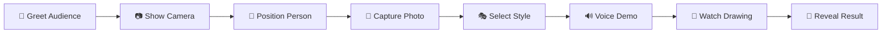
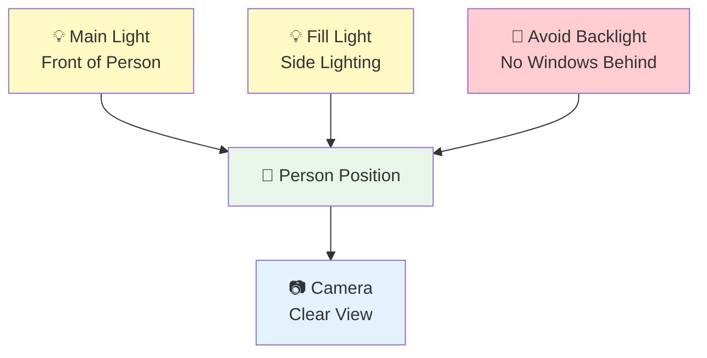
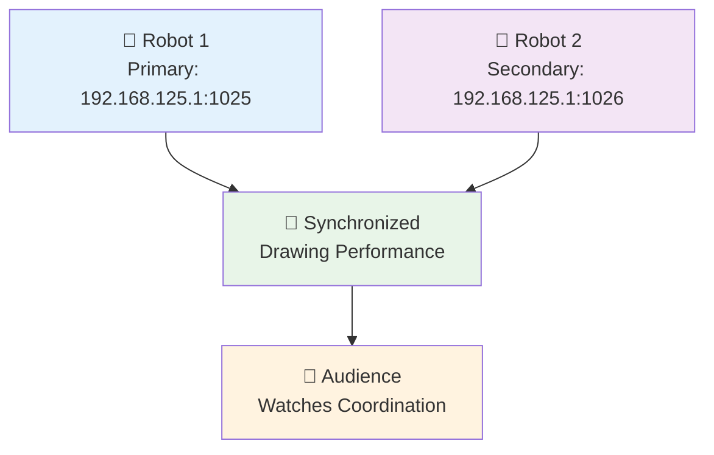
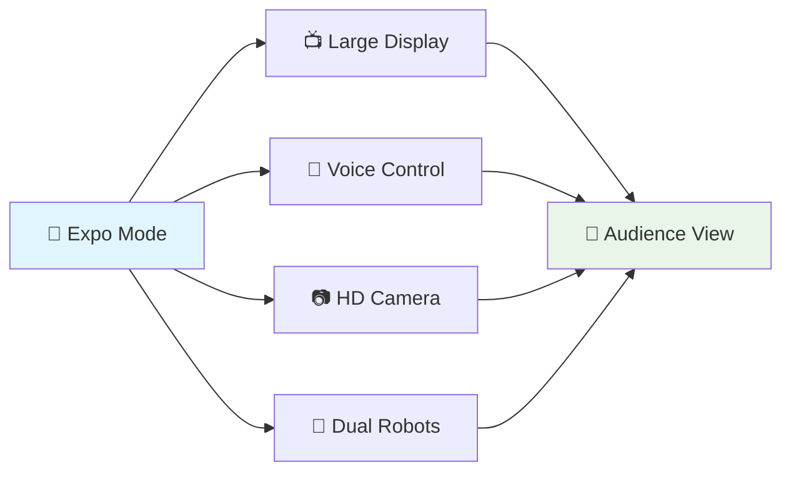

# 🎪 Expo Mode Guide

<div align="center">


**Complete guide for exhibition and demonstration setup**

</div>

---

## 🎯 Quick Demo Setup

### ⚡ **30-Second Demo Launch**

```bash
# 1. Launch the system
python simple_gui.py

# 2. Test voice commands (optional)
Say: "połącz" (connect)

# 3. Ready for audience!
```

### 🎪 **Perfect Demo Flow**

<div align="center">



</div>

---

## 🖥️ Display Setup

### 📺 **Optimal Screen Configuration**

<table align="center">
<tr>
<td width="50%" align="center">

#### 🎯 **Recommended Setup**


**✅ Specifications**
- **Resolution:** 1920x1080 (Full HD)
- **Size:** 24-32 inches
- **Position:** Eye level for audience
- **Angle:** Slight tilt toward audience

</td>
<td width="50%" align="center">

#### 📱 **Alternative Setups**


**✅ Also Works**
- Laptop: 15-17 inch (close demos)
- Tablet: Connected via HDMI
- Projector: Large audience demos
- Multiple screens: Advanced setups

</td>
</tr>
</table>

### 🎨 **Visual Layout**

| Element | Size | Position | Purpose |
|---------|------|----------|---------|
| 📷 **Camera Preview** | 1280x720 | Center modal | Live positioning |
| 🎭 **Style Triangle** | Diagonal overlay | Main canvas | Style selection |
| 🔊 **Voice Status** | Bottom bar | Always visible | Command feedback |
| 🤖 **Robot Status** | Top right | Connection area | System status |

---

## 📷 Camera & Lighting

### 💡 **Perfect Lighting Setup**

<div align="center">



</div>

| Lighting Type | Position | Purpose | Avoid |
|---------------|----------|---------|-------|
| 💡 **Main Light** | In front of person | Even face illumination | Direct glare into camera |
| 💡 **Fill Light** | 45° angle from side | Reduce shadows | Harsh shadows |
| 🚫 **No Backlight** | Behind person | - | Silhouette effect |
| 🌅 **Natural Light** | Window to side | Soft, even lighting | Direct sunlight |

### 📷 **Camera Positioning**

<table align="center">
<tr>
<td width="33%" align="center">

#### ✅ **Perfect Position**


- Camera at eye level
- 3-4 feet distance
- Clear background
- Good lighting on face

</td>
<td width="33%" align="center">

#### ⚠️ **Acceptable**


- Slightly off angle
- Busy background
- Mixed lighting
- Still functional

</td>
<td width="33%" align="center">

#### ❌ **Avoid**


- Very high/low angle
- Backlighting
- Dark environment
- Cluttered view

</td>
</tr>
</table>

---

## 🎤 Voice Command Demo

### 🔊 **Polish Voice Commands**

<div align="center">

| Command | Pronunciation | English | Demo Usage |
|---------|---------------|---------|------------|
| 🔗 **"połącz"** | /po-WONCH/ | "connect" | Connect to robots |
| 🚀 **"start"** | /start/ | "start" | Begin drawing |
| 🎭 **"karykatura"** | /ka-ry-ka-TU-ra/ | "caricature" | Artistic style |
| 🎨 **"portret"** | /POR-tret/ | "portrait" | Realistic style |

</div>

### 🎯 **Voice Demo Script**

```
👨‍🎤 Presenter: "Now I'll demonstrate hands-free voice control..."

🔊 Say: "połącz"
📱 System: [Shows connection status]

🔊 Say: "karykatura" 
📱 System: [Selects caricature mode]

🔊 Say: "start"
📱 System: [Begins drawing process]

👨‍🎤 Presenter: "The system responds to Polish voice commands!"
```

### 🎤 **Audio Setup Tips**

| Setup | Requirement | Benefit |
|-------|-------------|---------|
| 🎤 **Microphone** | USB or built-in | Voice command recognition |
| 🔊 **Speakers** | Clear audio output | System feedback |
| 🌆 **Noise Level** | Moderate background | Reliable recognition |
| 📍 **Distance** | 1-2 feet from mic | Optimal pickup |

---

## 🤖 Robot Demo Choreography

### 🎭 **Two-Robot Performance**

<div align="center">



</div>

### 🎪 **Demo Choreography**

| Phase | Robot 1 Action | Robot 2 Action | Audience Experience |
|-------|----------------|----------------|-------------------|
| 🏁 **Start** | Move to starting position | Move to starting position | Anticipation builds |
| 🎨 **Drawing** | Primary contours | Secondary details | Synchronized movement |
| 🔄 **Coordination** | Waits for partner | Catches up with batch | Perfect timing |
| 🎯 **Finishing** | Final details | Supporting strokes | Collaborative art |
| 🎉 **Complete** | Return to home | Return to home | Applause moment |

### ⚡ **Performance Tips**

<table align="center">
<tr>
<td width="50%" align="center">

#### 🎯 **Maximize Impact**


✅ **Start with simple drawing first**  
✅ **Explain the dual-robot coordination**  
✅ **Point out AI art conversion**  
✅ **Highlight voice control**  
✅ **Show live camera positioning**

</td>
<td width="50%" align="center">

#### 🛡️ **Stay Safe**


⚠️ **Keep workspace clear**  
⚠️ **Know emergency stop locations**  
⚠️ **Have backup plan ready**  
⚠️ **Test everything beforehand**  
⚠️ **Maintain safe audience distance**

</td>
</tr>
</table>

---

## 👥 Audience Engagement

### 🎯 **Interactive Elements**

<div align="center">

| Engagement | Method | Audience Reaction |
|------------|--------|-------------------|
| 📷 **Live Camera** | "Watch yourself on screen!" | Immediate connection |
| 🎭 **Style Choice** | "Portrait or caricature?" | Personal involvement |
| 🔊 **Voice Commands** | "Help me say 'start' in Polish!" | Active participation |
| 🤖 **Robot Watching** | "See how they work together!" | Technical appreciation |
| 🎨 **Art Reveal** | "Your drawing is complete!" | Satisfaction payoff |

</div>

### 🎪 **Demo Script Template**

```
👋 Opening:
"Welcome! This is an AI-powered robot drawing system with live camera preview."

📷 Camera Demo:
"First, let's take your picture with our HD camera preview system..."
[Show large camera window, position volunteer]

🎭 Style Selection:  
"Now choose your style - click left for realistic portrait, right for artistic caricature!"
[Point to diagonal triangle interface]

🔊 Voice Demo:
"We also have Polish voice commands - let's try saying 'połącz' to connect..."
[Demonstrate voice recognition]

🤖 Robot Show:
"Watch our two robots work together to create your drawing..."
[Point out coordination and synchronization]

🎉 Conclusion:
"And here's your AI-converted, robot-drawn artwork!"
[Show final result, audience applause]
```

### 🏆 **Advanced Engagement**

<table align="center">
<tr>
<td width="33%" align="center">

#### 🎓 **Educational**


- Explain AI conversion
- Show coordinate mapping
- Discuss robotics concepts
- Highlight computer vision

</td>
<td width="33%" align="center">

#### 🎪 **Entertainment**


- Multiple volunteers
- Style comparisons
- Voice command challenges
- Robot race timing

</td>
<td width="33%" align="center">

#### 🚀 **Technical**


- Show system architecture
- Explain dual-robot coordination
- Demonstrate path optimization
- Discuss AI algorithms

</td>
</tr>
</table>

---

## 🛠️ Technical Setup

### 🔧 **Pre-Demo Checklist**

<div align="center">

| Component | Check | Status | Backup Plan |
|-----------|-------|---------|-------------|
| 💻 **Computer** | System running | ✅ | Backup laptop |
| 📷 **Camera** | HD preview working | ✅ | USB camera |
| 🤖 **Robots** | Both connected | ✅ | Single robot mode |
| 🔊 **Voice** | Recognition active | ✅ | Mouse/keyboard only |
| 🌐 **Network** | Robot connectivity | ✅ | Offline demo |
| 🎤 **Audio** | Microphone working | ✅ | Silent demo |

</div>

### ⚙️ **System Configuration**

```json
{
  "expo_mode": {
    "camera_preview_size": "1280x720",
    "popup_notifications": false,
    "voice_commands": true,
    "demo_mode": true,
    "robot_coordination": "dual_arm",
    "safety_checks": true
  }
}
```

### 🚨 **Emergency Procedures**

<table align="center">
<tr>
<td width="50%" align="center">

#### 🛑 **Emergency Stop**


**Immediate Actions:**
1. 🔴 Press GUI emergency stop
2. 🔴 Physical robot stop buttons
3. 🔌 Power disconnect if needed
4. 👥 Clear audience from area

</td>
<td width="50%" align="center">

#### 🔄 **System Recovery**


**Recovery Steps:**
1. 🔄 Restart application
2. 🔍 Check robot positions
3. 🧪 Test with simple drawing
4. ✅ Verify all systems
5. 🎪 Resume demonstration

</td>
</tr>
</table>

### 🎯 **Troubleshooting**

| Problem | Quick Fix | Prevention |
|---------|-----------|------------|
| 📷 Camera not starting | Restart app, check USB | Test before audience |
| 🤖 Robot not responding | Check network, reconnect | Verify connectivity |
| 🔊 Voice not working | Check microphone, restart | Test voice commands |
| 💻 System slow | Close other apps | Dedicated demo machine |
| 🎨 Drawing errors | Emergency stop, restart | Regular system testing |

---

## 🎉 Demo Variations

### 🎭 **Different Demo Styles**

<table align="center">
<tr>
<td width="33%" align="center">

#### ⚡ **Quick Demo**


**⏱️ 5 Minutes**
- Take photo quickly
- Choose one style
- Voice command demo
- Watch robots draw
- Show result

</td>
<td width="33%" align="center">

#### 🎯 **Standard Demo**


**⏱️ 10 Minutes**
- Explain system overview
- Live camera positioning
- Style comparison
- Full voice demo
- Detailed robot watching
- Educational explanation

</td>
<td width="33%" align="center">

#### 🎪 **Full Experience**


**⏱️ 15+ Minutes**
- Complete system walkthrough
- Multiple volunteers
- Both style demonstrations
- Technical explanations
- Q&A session
- Behind-the-scenes tour

</td>
</tr>
</table>

### 🎨 **Creative Variations**

| Variation | Description | Audience |
|-----------|-------------|----------|
| 🎭 **Style Battle** | Same person, both styles | Entertainment |
| 👥 **Group Portrait** | Multiple people | Teams/families |
| 🎓 **Educational** | Explain each step | Schools/students |
| 🚀 **Technical** | Show code and algorithms | Engineers/developers |
| 🎪 **Competition** | Fastest/best drawing | Interactive events |

---

## 📊 Success Metrics

### 🎯 **Audience Engagement Indicators**

<div align="center">

| Metric | Good | Great | Amazing |
|:------:|:----:|:-----:|:-------:|
| 👀 **Attention** | Watching demo | Asking questions | Taking photos/videos |
| 🎤 **Participation** | Following instructions | Volunteering | Suggesting variations |
| 😊 **Reactions** | Polite interest | Visible excitement | Laughter and applause |
| 📱 **Social Sharing** | Some photos | Multiple posts | Video sharing |
| 🔄 **Return Visitors** | One-time viewing | Bringing friends | Repeat demonstrations |

</div>

### 📈 **Technical Success**

| Component | Success Rate | Target | Excellent |
|-----------|--------------|---------|-----------|
| 📷 **Camera Startup** | >90% | First try | Instant |
| 🤖 **Robot Connection** | >95% | Within 30s | Under 10s |
| 🔊 **Voice Recognition** | >80% | Clear commands | Noisy environments |
| 🎨 **Drawing Completion** | >98% | No interruptions | Perfect execution |
| 👥 **Audience Satisfaction** | >85% | Positive feedback | Enthusiastic response |

---

## 🎪 Advanced Expo Features

### 🎨 **Professional Presentation Mode**

<div align="center">



</div>

### 🚀 **Future Enhancements**

| Feature | Status | Timeline | Impact |
|---------|--------|----------|---------|
| 🎥 **Live Streaming** | Planned | Future update | Remote audiences |
| 📱 **Mobile Control** | Concept | Research phase | Tablet integration |
| 🌐 **Web Interface** | Idea | Long-term | Browser control |
| 🎮 **Game Mode** | Concept | Fun addition | Interactive competition |
| 📊 **Analytics** | Planned | Data collection | Performance insights |

---

<div align="center">

## 🎪 **Perfect Exhibition Experience**


**Complete guide for flawless demonstrations and maximum audience engagement**

---

### 🌟 **Ready to Wow Your Audience?**

Follow this guide for professional exhibitions, trade shows, maker faires, and educational demonstrations. Your advanced robot drawing system is ready to impress!

</div>
