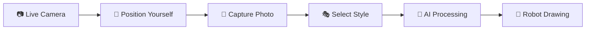

# 🤖 Advanced Robot Drawing System

<div align="center">


**Professional AI-powered robotic drawing system with live camera preview, voice commands, and expo-ready interface**

[🎪 Quick Demo](#-expo-demo-mode) • [🚀 Getting Started](#-getting-started) • [🎭 AI Features](#-ai-art-conversion) • [🔊 Voice Commands](#-voice-control)

</div>

---

## ✨ Modern Features

<table>
<tr>
<td width="50%" align="center">

### 🎪 **Expo-Ready Interface**


✅ **Clean, popup-free experience**  
✅ **Live camera preview with positioning**  
✅ **Diagonal triangle style selection**  
✅ **AI-powered art conversion**  
✅ **Real-time progress tracking**  
✅ **Professional demonstration mode**

</td>
<td width="50%" align="center">

### 🤖 **Dual-Robot Coordination**


✅ **Synchronized dual-arm drawing**  
✅ **Intelligent path distribution**  
✅ **Real-time coordination**  
✅ **Voice command integration**  
✅ **Emergency stop system**  
✅ **Professional TCP communication**

</td>
</tr>
</table>

## 🎪 Expo Demo Mode

Perfect for exhibitions and demonstrations with a completely streamlined experience:

<div align="center">



</div>

### 🎯 **Demo Workflow**
1. **📷 Take Picture** → Live HD camera preview with real-time positioning
2. **🎭 Choose Style** → Diagonal triangle interface: Portrait vs Caricature
3. **🔊 Voice Control** → Hands-free Polish commands ("połącz", "start", "karykatura")
4. **🤖 Watch Magic** → Dual-robot coordinated drawing with progress tracking

### ✨ **Exhibition Features**
- **Zero Popups** → Clean, uninterrupted demo experience
- **Live Preview** → 1280x720 HD camera with mirror effect for natural positioning  
- **Instant Feedback** → Visual processing indicators and status updates
- **Professional Interface** → Optimized for 1920x1080 displays

## 🎭 AI Art Conversion

<table align="center">
<tr>
<td width="50%" align="center">

### 🎨 **Portrait Mode**


**Professional face drawing conversion**
- Realistic proportions and details
- Optimized for human features
- Clean line art generation
- Perfect for portraits and selfies

</td>
<td width="50%" align="center">

### 🎭 **Caricature Mode**  


**Stylized artistic interpretation**
- Exaggerated features and expressions
- Creative artistic style
- Fun and engaging results
- Great for entertainment and demos

</td>
</tr>
</table>

### 🧠 **AI Processing Pipeline**
1. **Image Capture** → High-quality photo from live camera preview
2. **AI Analysis** → Advanced computer vision and style transfer
3. **Line Art Generation** → Optimized vector paths for robot drawing
4. **Path Optimization** → Intelligent routing for dual-robot coordination

## 📷 Live Camera System

<div align="center">

### 🎥 **Professional Camera Preview**


</div>

| Feature | Specification | Benefit |
|---------|---------------|---------|
| 🎥 **Resolution** | 1280x720 HD | Crystal clear preview |
| 🖥️ **Display** | 1400x1000 window | Large positioning area |
| 🔄 **Frame Rate** | 30 FPS | Smooth real-time preview |
| 🪞 **Mirror Effect** | Automatic | Natural selfie experience |
| ⚡ **Startup** | DirectShow optimized | Faster camera initialization |

### ✨ **Smart Features**
- **Live Positioning** → See yourself in real-time before capture
- **Professional Interface** → Dark theme with clear controls
- **Instant Capture** → One-click photo taking
- **Automatic Integration** → Seamless workflow to AI processing

## 🔊 Voice Control

<div align="center">

### 🎤 **Polish Voice Commands**


</div>

| Command | Action | Demo Usage |
|---------|--------|-------------|
| 🔗 **"połącz"** | Connect to robots | Initial setup |
| 🚀 **"start"** | Begin drawing process | Start demonstration |
| 🎭 **"karykatura"** | Switch to caricature mode | Style selection |
| 🎨 **"portret"** | Switch to portrait mode | Style selection |

### 🎯 **Voice System Features**
- **Background Listening** → Always ready for commands
- **Polish Language** → Native language support
- **Noise Filtering** → Reliable recognition in noisy environments
- **Visual Feedback** → Clear confirmation of recognized commands

## 🤖 Dual-Robot Coordination

<div align="center">

### 🎛️ **Advanced Robotics**


</div>

| Robot | IP Address | Port | Role |
|-------|------------|------|------|
| 🤖 **Primary** | `192.168.125.1` | `1025` | Main drawing coordination |
| 🤖 **Secondary** | `192.168.125.1` | `1026` | Synchronized drawing partner |

### ⚡ **Coordination Features**
- **Intelligent Path Distribution** → Optimal work sharing between robots
- **Real-time Synchronization** → Coordinated movement and timing
- **Batch Processing** → Efficient command batching for smooth operation
- **Emergency Stop** → Immediate halt of both robots if needed

## 🚀 Getting Started

### 📦 **Quick Installation**

```bash
# Install required dependencies
pip install opencv-python numpy pillow matplotlib vosk openai requests

# Clone and run
git clone <your-repo>
cd moje_skrypty
python simple_gui.py
```

### 🎮 **First Demo**

1. **🚀 Launch** → Run `python simple_gui.py`
2. **📷 Camera** → Click "Take Picture" for live preview
3. **🎯 Position** → Center yourself in the large preview window
4. **📸 Capture** → Click "Take Photo" when ready
5. **🎭 Style** → Click diagonal triangle: left=Portrait, right=Caricature
6. **🔊 Voice** → Say "połącz" to connect robots
7. **🎨 Draw** → Say "start" or click to begin drawing

### ⚙️ **Robot Setup**

```bash
# Network Configuration
Robot IP: 192.168.125.1
Primary Port: 1025
Secondary Port: 1026
Workspace: 290mm × 210mm
Protocol: ASCII TCP
```

## 🏗️ System Architecture

<div align="center">

```mermaid
graph TB
    A[🎪 Expo GUI<br/>simple_gui.py] --> B[📷 Live Camera<br/>HD Preview System]
    A --> C[🔊 Voice Commands<br/>Polish Recognition]
    A --> D[🎭 AI Conversion<br/>convert_to_lineart.py]
    
    D --> E[🎨 Portrait AI<br/>Face Drawing]
    D --> F[🎭 Caricature AI<br/>Artistic Style]
    
    A --> G[🤖 Dual Robot Control<br/>robot_communication.py]
    G --> H[🤖 Primary Robot<br/>192.168.125.1:1025]
    G --> I[🤖 Secondary Robot<br/>192.168.125.1:1026]
    
    B --> J[📸 Photo Capture<br/>1280x720 HD]
    C --> K[🎤 Vosk Engine<br/>Polish Language]
    
    style A fill:#e1f5fe
    style B fill:#f3e5f5
    style C fill:#e8f5e8
    style D fill=#fff3e0
    style E fill:#ffebee
    style F fill:#f1f8e9
    style G fill:#e0f2f1
    style H fill:#fce4ec
    style I fill:#e8eaf6
    style J fill:#f9fbe7
    style K fill:#faf2cc
```

</div>

### 🗂️ **Project Structure**

```
📁 Advanced Robot Drawing System/
├── 🎪 simple_gui.py              # Modern expo-ready interface
├── 🎭 convert_to_lineart.py      # AI art conversion engine  
├── 🔊 voice_commands.py          # Polish voice recognition
├── 🤖 robot_communication.py     # Dual-robot TCP control
├── 📷 robot_ftp_downloader.py    # Camera integration
├── 🎯 robot_drawer.py            # Main drawing orchestrator
├── 🖼️ image_processor.py         # OpenCV operations
├── 📐 coordinate_transformer.py   # Robot coordinate mapping
├── 📊 visualizer.py              # Real-time visualization
├── 🎨 matplotlib_anim_helper.py  # Animation support
├── 📖 README.md                  # This documentation
└── 🧪 test_*.py                  # Testing utilities
```

## 🎨 Exhibition Setup

### 🎪 **Perfect for Demonstrations**

<table align="center">
<tr>
<td width="33%" align="center">

#### 🖥️ **Display Setup**

- Optimized for 1920x1080
- Large camera preview  
- Clear style selection
- Professional appearance

</td>
<td width="33%" align="center">

#### 🎤 **Audio Setup**

- Microphone for voice commands
- Polish language recognition
- Background noise filtering
- Clear audio feedback

</td>
<td width="33%" align="center">

#### 🤖 **Robot Setup**

- Two ABB robots configured
- Network connectivity verified
- Workspace area clear
- Emergency stops accessible

</td>
</tr>
</table>

### ✨ **Demo Best Practices**

- **🎯 Preparation** → Test all systems before audience arrives
- **📷 Camera Lighting** → Ensure good lighting for camera preview
- **🔊 Audio Check** → Verify voice command recognition
- **🎪 Crowd Control** → Keep workspace area clear during operation
- **🛑 Safety First** → Know emergency stop locations

## 🔧 Technical Specifications

<div align="center">

| Component | Technology | Purpose |
|-----------|------------|---------|
| 🎪 **Interface** | Tkinter + Advanced Canvas | Expo-ready GUI |
| 📷 **Camera** | OpenCV + DirectShow | Live HD preview |
| 🔊 **Voice** | Vosk + Polish Model | Voice recognition |
| 🎭 **AI** | OpenAI API + Custom Prompts | Art conversion |
| 🤖 **Robots** | TCP/IP + Custom Protocol | Dual-arm control |
| 🎨 **Processing** | NumPy + Advanced Algorithms | Image optimization |

</div>

---

<div align="center">

## ⚠️ Safety & Demo Guidelines

**🚨 EXHIBITION SAFETY: Always ensure robot workspace is clear before demonstrations**

- ✅ **Pre-Demo Check** → Verify all systems and safety measures
- 🛑 **Emergency Access** → Keep emergency stops easily accessible  
- 👥 **Audience Safety** → Maintain safe distance from robot workspace
- 🎤 **Voice Commands** → Demonstrate voice control for audience engagement
- 📷 **Camera Demo** → Show live positioning system to wow the crowd

---

### 🌟 **Advanced AI-Powered Robot Drawing System**


**Perfect for exhibitions, demonstrations, and professional robotic showcases**

*Professional robotic drawing system with AI art conversion, live camera preview, and voice control*

</div>
