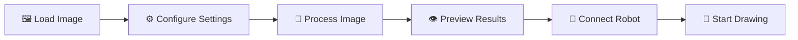
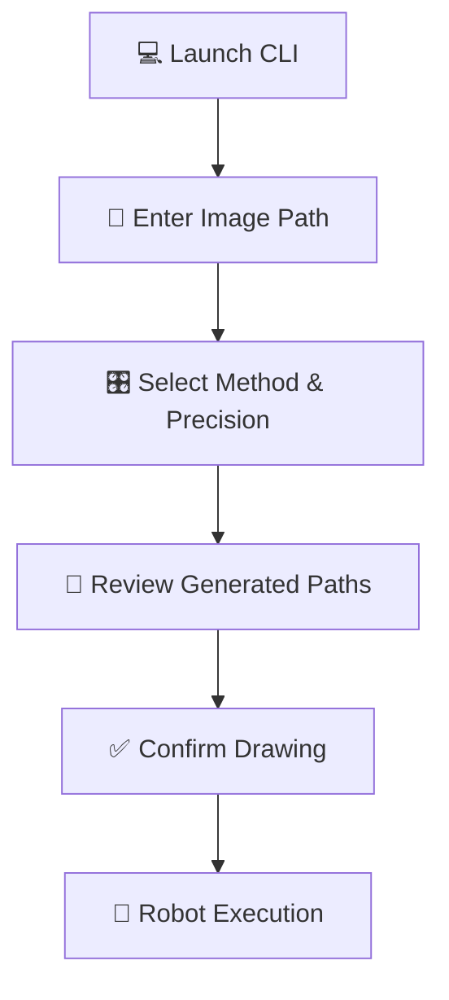
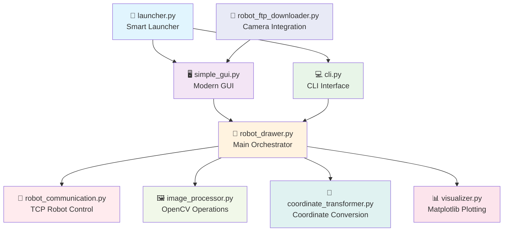
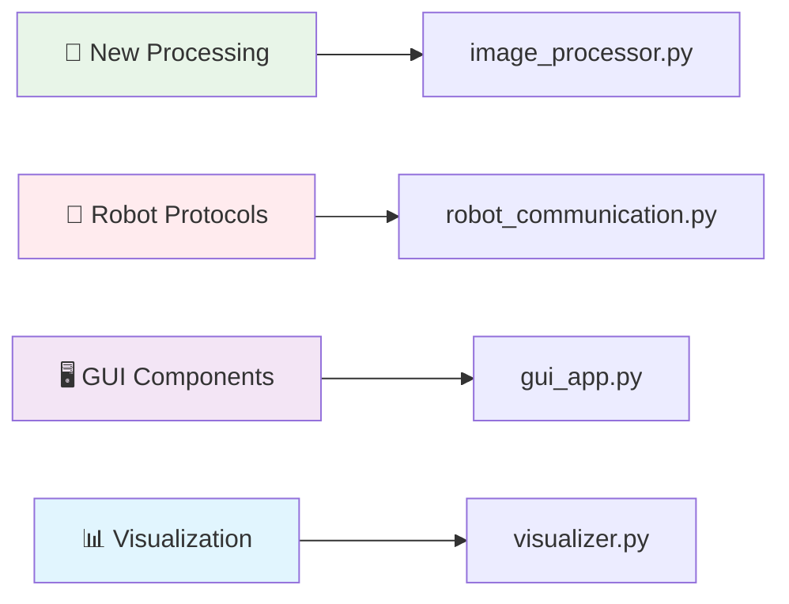

# 🤖 Robot Drawing System v1.0

<div align="center">


**Professional image-to-drawing conversion system for ABB robots with advanced computer vision**

[🚀 Quick Start](#-quick-start) • [📖 Documentation](#-how-to-use) • [🔧 Installation](#-system-requirements) • [🎯 Features](#-features)

</div>

---

## ✨ Features

<table>
<tr>
<td width="50%" align="center">

### 🖥️ **Modern GUI Interface**


✅ **Real-time image processing preview**  
✅ **Interactive drawing canvas**  
✅ **Advanced parameter controls**  
✅ **Live robot path visualization**  
✅ **Progress tracking & emergency stop**  
✅ **Template library & camera integration**

</td>
<td width="50%" align="center">

### 💻 **Command Line Power**


✅ **Full automation support**  
✅ **Batch processing ready**  
✅ **Scriptable workflows**  
✅ **Advanced configuration**  
✅ **TSP path optimization**  
✅ **Professional logging**

</td>
</tr>
</table>

## 🎯 Core Capabilities

<div align="center">

| 🎨 **Image Processing** | 🤖 **Robot Control** | 📊 **Visualization** | 🔧 **Advanced Features** |
|:---:|:---:|:---:|:---:|
| Advanced edge detection | TCP/IP communication | Real-time path preview | TSP optimization |
| Smart contour extraction | Precise coordinate mapping | Interactive matplotlib plots | Line length limiting |
| Adaptive simplification | Safety protocols | Multi-panel displays | Smoothing algorithms |
| Multiple precision levels | ABB YuMi support | Progress monitoring | FTP camera integration |

</div>

## 🚀 Quick Start

<details>
<summary><b>🎯 Option 1: Smart Launcher (Recommended)</b></summary>

```bash
# One command to rule them all
python launcher.py
```

**What you'll see:**
```
==================================================
      ROBOT DRAWING SYSTEM
==================================================

Choose your interface:
1. GUI Application (Recommended) ✨
2. Command Line Interface 💻
3. Exit 👋
```

</details>

<details>
<summary><b>⚡ Option 2: Direct Launch</b></summary>

```bash
# 🖥️ Modern GUI (Best for beginners)
python simple_gui.py

# 💻 Command Line (Best for pros)
python cli.py
```

</details>

---

## 🔧 System Requirements

<div align="center">

| Component | Requirement | Install Command |
|-----------|-------------|-----------------|
| 🐍 **Python** | 3.7+ | [Download Python](https://python.org) |
| 👁️ **OpenCV** | Latest | `pip install opencv-python` |
| 🔢 **NumPy** | Latest | `pip install numpy` |
| 🖼️ **Pillow** | For GUI | `pip install pillow` |
| 📊 **Matplotlib** | For GUI | `pip install matplotlib` |

</div>

### � One-Line Installation
```bash
pip install opencv-python numpy pillow matplotlib
```

### 🔄 FTP Integration (Optional)
For robot camera integration, the FTP downloader is included:
```bash
# Downloads images directly from ABB YuMi robot
python robot_ftp_downloader.py
```

## 📖 How to Use

### 🖥️ GUI Workflow (Visual & Intuitive)

<div align="center">



</div>

| Step | Action | Description |
|:----:|--------|-------------|
| **1** | 🚀 **Launch** | Run `python launcher.py` → Select **GUI (1)** |
| **2** | 📁 **Load Image** | Load file or use drawing canvas/templates |
| **3** | ⚙️ **Configure** | Choose quality level & TSP optimization |
| **4** | 🔄 **Process** | System automatically processes image |
| **5** | 👁️ **Preview** | Review 3-panel preview with robot paths |
| **6** | 🔗 **Connect** | Connect to robot at `192.168.125.1:1025` |
| **7** | 📷 **Camera** | Optional: Get picture from robot camera |
| **8** | 🎨 **Draw** | Start drawing with progress monitoring |

### 💻 CLI Workflow (Power Users)

<div align="center">



</div>

```bash
# Professional 5-step process
python cli.py
> Enter path: my_image.jpg
> Quality: 2 (High)
> TSP optimization: y
> Preview: ✓ 5 contours, 234 points
> Proceed? y
```

## 🏗️ Architecture

<div align="center">



</div>

### 🔄 Processing Pipeline

<div align="center">

| Stage | Component | Function | Technology |
|:-----:|-----------|----------|------------|
| **1** | 📥 **Image Loading** | File validation & loading | OpenCV + PIL |
| **2** | 🔍 **Edge Detection** | Canny algorithm processing | Computer Vision |
| **3** | 🎯 **Contour Extraction** | Smart path finding | Geometric Analysis |
| **4** | ⚡ **Path Optimization** | TSP + Douglas-Peucker | Mathematical Optimization |
| **5** | 📐 **Coordinate Transform** | Pixel → Robot coordinates | Mathematical Mapping |
| **6** | 🎨 **Smoothing & Limiting** | Line length optimization | Advanced Algorithms |
| **7** | 🤖 **Robot Communication** | TCP command execution | Network Protocol |

</div>

### 🎨 Quality Levels & Features

<table align="center">
<tr>
<td align="center" width="25%">

#### 🔬 **Highest Quality**


- 🎯 **Maximum detail preservation**
- 📊 **Professional artwork quality**
- ⏱️ **Longer processing time**
- 🖼️ **Perfect for complex images**

</td>
<td align="center" width="25%">

#### ⚡ **High Quality**


- 🎯 **Excellent detail balance**
- ⚡ **Reasonable processing time**
- 🎨 **Great for most images**
- 🏃 **Recommended default**

</td>
<td align="center" width="25%">

#### 🌟 **Medium Quality**


- 🎯 **Good detail level**
- ⚡ **Fast processing**
- ✏️ **Perfect for sketches**
- 🎨 **Simplified drawings**

</td>
<td align="center" width="25%">

#### 💨 **Low Quality**


- 🎯 **Basic outlines only**
- ⚡ **Fastest processing**
- ✏️ **Quick prototypes**
- 🎨 **Simple line art**

</td>
</tr>
</table>

### 🚀 Advanced Features

<div align="center">

| Feature | Description | Benefit |
|:-------:|-------------|---------|
| 🧠 **TSP Optimization** | Traveling Salesman Problem solver | Shorter drawing paths, faster completion |
| 📏 **Line Length Limiting** | Maximum segment length control | Smoother robot movement, better quality |
| 🎨 **Interactive Canvas** | Built-in drawing tool | Create custom drawings without external software |
| 📋 **Template Library** | Pre-made shapes (circle, star, heart) | Quick testing and demonstration |
| 📷 **Camera Integration** | FTP download from robot camera | Direct image capture from robot workspace |
| 🛑 **Emergency Stop** | Real-time process termination | Safety and control during operation |

</div>

### 🎛️ Precision Control

<div align="center">

| Level | Factor | Use Case | Processing Time | Detail Level |
|:-----:|:------:|----------|:---------------:|:------------:|
| 🔬 **Highest** | `0.0002` | Professional artwork | ⏱️⏱️⏱️⏱️ | ⭐⭐⭐⭐⭐ |
| 🎯 **High** | `0.0008` | Detailed drawings (default) | ⏱️⏱️⏱️ | ⭐⭐⭐⭐ |
| ⚖️ **Medium** | `0.002` | Balanced approach | ⏱️⏱️ | ⭐⭐⭐ |
| ⚡ **Low** | `0.005` | Quick sketches | ⏱️ | ⭐⭐ |

</div>

## 🤖 Robot Configuration

<div align="center">

### 📡 **Network Settings**
| Parameter | Value | Description |
|-----------|-------|-------------|
| 🌐 **IP Address** | `192.168.125.1` | ABB Robot IP |
| 🔌 **Port** | `1025` | TCP Communication Port |
| 📏 **Workspace** | `290mm × 210mm` | Drawing Area |
| 📝 **Protocol** | `ASCII TCP` | Command Format |

### 🎮 **Command Set**
```bash
MOVE,145.50,89.25    # 📍 Move to coordinates (mm)
PEN_UP               # ✋ Lift pen from surface
PEN_DOWN             # ✍️ Lower pen to surface  
STOP                 # 🛑 End drawing sequence
get_pic              # 📷 Capture image with robot camera
```

</div>

---

## 🎨 GUI Features Showcase

<div align="center">

### 🎛️ **Control Panel**


</div>

| Section | Features | Benefits |
|---------|----------|----------|
| 📁 **Image Input** | File browser, drawing canvas, templates | Multiple input methods |
| ⚙️ **Quality Control** | 4-level precision system | Optimized for any use case |
| 🧠 **TSP Optimization** | Smart path planning toggle | Faster drawing completion |
| 🚀 **Action Workflow** | Process → Connect → Draw | Guided step-by-step operation |
| 📷 **Camera Integration** | Direct robot camera access | Real-time workspace capture |

<div align="center">

### 👁️ **Preview System**


</div>

| Panel | Content | Purpose |
|-------|---------|---------|
| 🖼️ **Original Image** | Source image display | Visual reference and validation |
| 🤖 **Robot Path Preview** | Interactive matplotlib visualization | Path optimization and planning |
| 📊 **Progress Monitoring** | Real-time drawing progress | Live feedback and control |

### ✨ **Professional Features**

<table align="center">
<tr>
<td width="33%" align="center">

#### 🔄 **Multi-Threading**

- Background processing
- Responsive UI always
- Real-time progress updates

</td>
<td width="33%" align="center">

#### 🛡️ **Error Handling**  

- Comprehensive validation
- User-friendly messages  
- Graceful error recovery

</td>
<td width="33%" align="center">

#### 🎯 **Smart Automation**

- Automatic processing
- Quality optimization
- Emergency stop system

</td>
</tr>
</table>

## 🔧 Troubleshooting

<details>
<summary><b>🖥️ GUI Issues</b></summary>

| Problem | Solution | Command |
|---------|----------|---------|
| ❌ "GUI dependencies missing" | Install required packages | `pip install pillow matplotlib` |
| 🖼️ Image not displaying | Check file format support | Use JPG, PNG, BMP, TIFF |
| 🐌 Slow processing | Reduce quality level | Try "Medium" or "Low" quality |
| 💾 Memory issues | Use smaller images | Resize image < 2MB |
| 🎨 Canvas not working | PIL dependency issue | `pip install --upgrade pillow` |
| 📋 Templates not loading | Temporary directory access | Check user permissions |

</details>

<details>
<summary><b>🤖 Robot Connection</b></summary>

| Problem | Possible Cause | Solution |
|---------|---------------|----------|
| 🔴 Connection failed | Network issue | Check IP: `192.168.125.1` |
| 📡 No response | Robot not ready | Verify port `1025` is open |
| ⏱️ Timeout | Firewall blocking | Configure network settings |
| 🔄 Commands ignored | Robot program issue | Restart robot controller |
| 📷 Camera not working | FTP issue | Check `robot_ftp_downloader.py` settings |
| 🛑 Emergency stop failed | Network interruption | Physical robot emergency stop |

</details>

<details>
<summary><b>🖼️ Image Processing</b></summary>

| Problem | Cause | Solution |
|---------|-------|---------|
| 🚫 No contours found | Low contrast image | Adjust image brightness/contrast |
| 📊 Too many details | High quality + complex image | Use lower quality setting |
| 🎯 Path looks wrong | Edge detection issue | Check original image quality |
| ⚡ Processing slow | Large image file | Resize image or lower quality |
| 🧠 TSP too slow | Complex path optimization | Disable TSP for large images |
| 📏 Lines too long | Line limiting disabled | Enable line length limiting |

</details>

---

## 🎯 Supported Formats

<div align="center">

| Format | Extension | Best For | Quality |
|:------:|:---------:|----------|:-------:|
| 📸 **JPEG** | `.jpg`, `.jpeg` | Photos, complex images | ⭐⭐⭐ |
| 🖼️ **PNG** | `.png` | Graphics, transparency | ⭐⭐⭐⭐⭐ |
| 🎨 **BMP** | `.bmp` | Simple graphics | ⭐⭐⭐⭐ |
| 📄 **TIFF** | `.tiff` | High-quality scans | ⭐⭐⭐⭐⭐ |

</div>

---

## 🚀 Development

### 🔧 **Adding New Features**

The modular architecture makes expansion easy:



### 🗂️ **Project Structure**

```
📁 robot-drawing-system/
├── 🚀 launcher.py              # Smart application launcher
├── 🖥️ simple_gui.py            # Modern GUI interface  
├── 💻 cli.py                   # Command-line interface
├── 🎯 robot_drawer.py          # Main orchestrator class
├── 🤖 robot_communication.py   # TCP robot controller
├── 🖼️ image_processor.py       # OpenCV operations
├── 📐 coordinate_transformer.py # Coordinate conversion
├── 📊 visualizer.py            # Matplotlib plotting
├── 📡 robot_ftp_downloader.py  # Robot camera integration
├── 📖 README.md               # This documentation
├── 📚 *.md                    # Technical documentation
└── 🧪 test_*.py               # Testing & comparison scripts
```

### 📚 **Version History**

<div align="center">

| Version | Release | Features | Status |
|:-------:|:-------:|----------|:------:|
| **v1.0** | 🆕 Latest | Professional GUI, CLI, TSP optimization, Camera integration | ✅ Current |

</div>

---

<div align="center">

## ⚠️ Safety Notice

**🚨 IMPORTANT: Always ensure the robot workspace is clear before starting any drawing operation.**

- The system sends movement commands **immediately** after clicking "Start Drawing"
- Use the **Emergency Stop** button if needed during operation
- Verify robot workspace is clear of obstacles
- Ensure proper pen mounting and ink levels
- Test with simple drawings before complex operations

---

### 🌟 **Professional Robot Drawing System v1.0**


**⭐ Star this project if you found it helpful! ⭐**

*Developed for advanced robotics applications with professional-grade computer vision and automation.*

</div>
